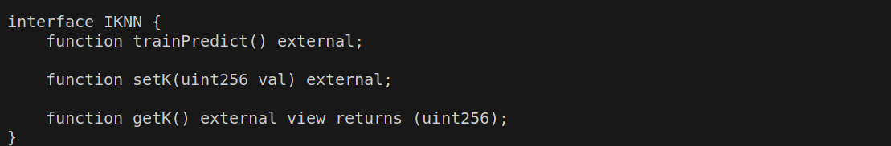
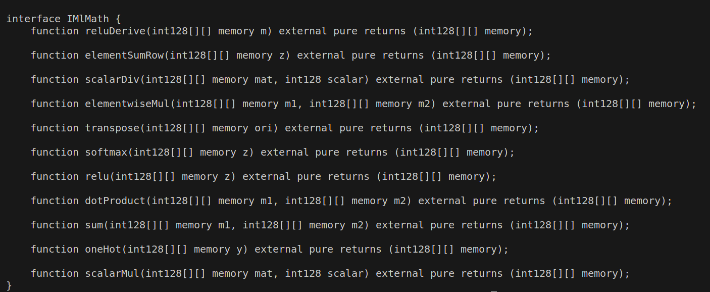
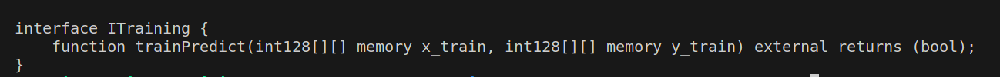

# SKECTH-STYLUS

## Introduction

This is a hand written and optimized machine learning library written in Rust using Arbitrum's Stylus [SDK](https://docs.arbitrum.io/stylus/stylus-quickstart).

This library implements the following:

- K Nearest Neighbours
- Logistic Regression
- Digit Recognizer ML Model
- Machine Learning Math library

## Feautures

- For avoiding the loss of precision in weights and biases, scaling has been implemented.
- Minimal use of std library.
- The size of WASM contract and deployment gas for each is listed below.

### KNN

> Uncompressed size - 24.4 KB
>
> Compressed size - 8.9 KB
>
> Deployment gas -
>
>Exported ABI - 
> 

### Logistic Regression

> Uncompressed size - 55.8 KB
>
> Compressed size - 17.5 KB
>
> Deployment gas -
>
>

### ML-math

> Uncompressed size - 45.2 KB
>
> Compressed size - 13.1 KB
>
> Deployment gas -
>
>Exported ABI - 
>

### Digit Recognizer

> Uncompressed size - 52 KB
>
> Compressed size - 16.5 KB
>
> Deployment gas -
>
>Exported ABI - 
>
